# CTEC3903 Front End Web Development

## Portfolio Website

### 1. Choice of Wesbite

    I chose to produce a portfolio website because it can be used as evidence to show my ability to produce responsive websites.

    The Link to my original website can be found below: 

    GitHub Repo: [GitHub repo](https://github.com/Front-end-development-2017/Assignment-2)
    Github pages: [GitHub Pages](https://front-end-development-2017.github.io/Assignment-2/)

### 2. Wireframe Sketches
    

### 3. Responsive Layout 

#### Mobile View 

#### Tablet View 

#### Desktop View 

### 4. Folder Layout

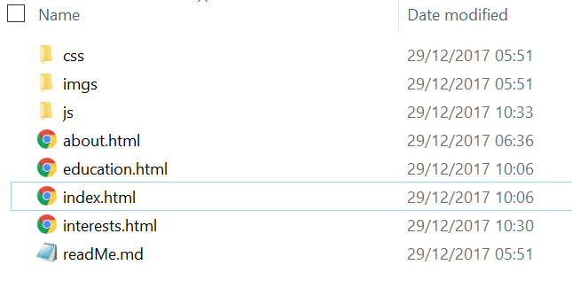

### 5. HTML Validation

Index.html 

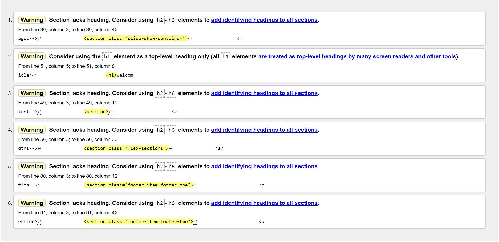

About.html 

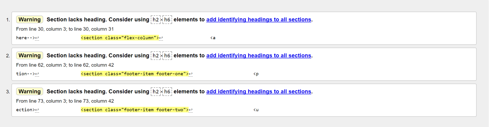

Education.html

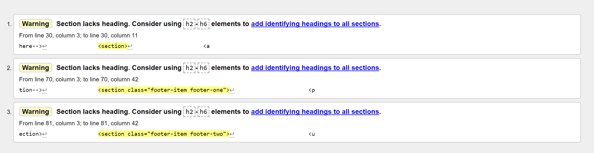

Interests.html

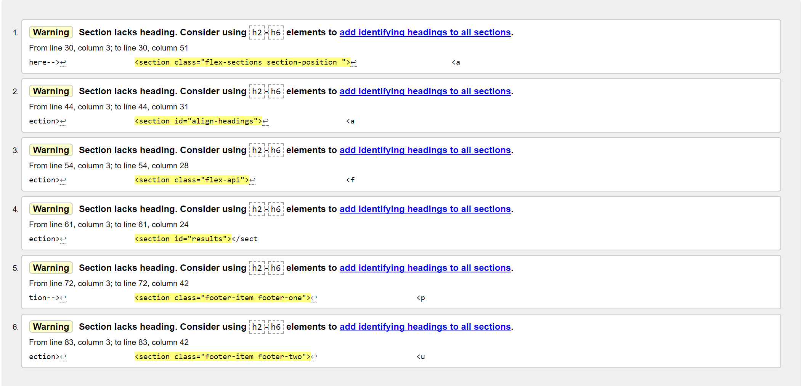

### 6. Use of Flickr API

Flickr API 

Responsive API on mobile

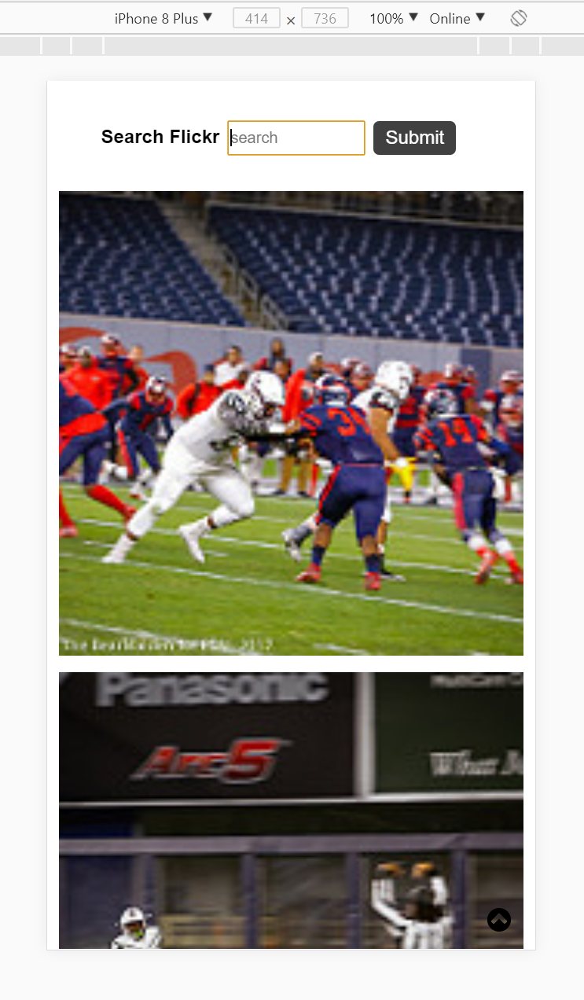

Responsive API on Tablet

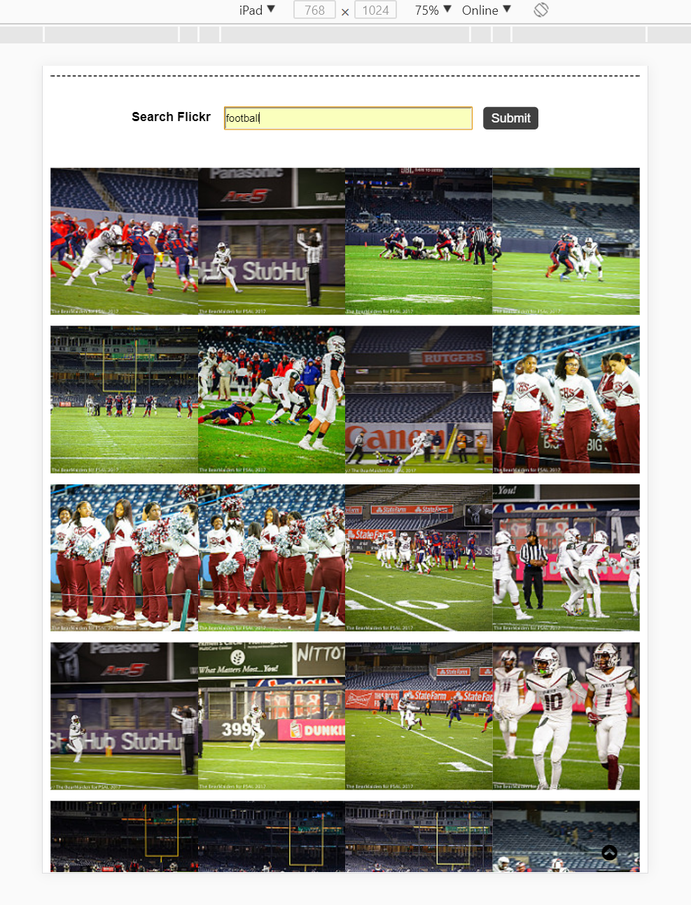

Responsive API on Desktop

### 7. Html Indentation

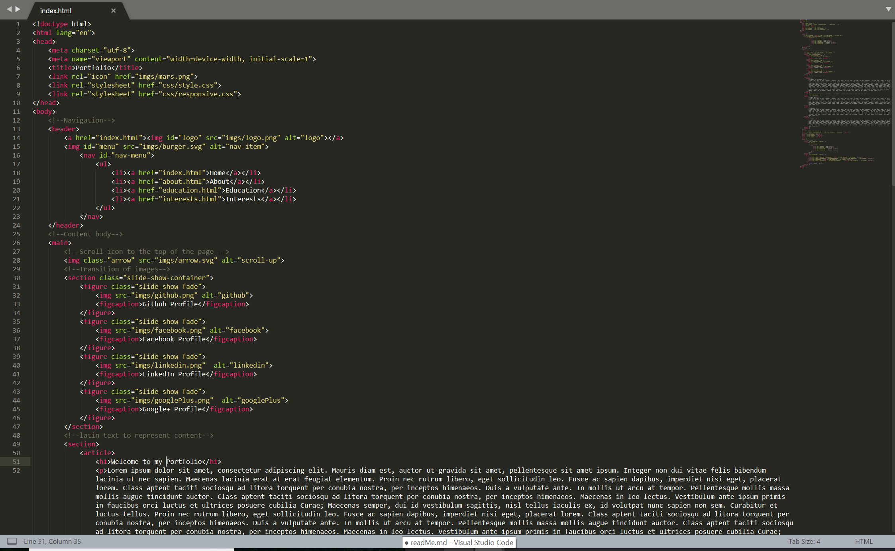

### 8. CSS Syntax and Flex

Used flex often to style my content (Has benefits of being reusable in other pages)

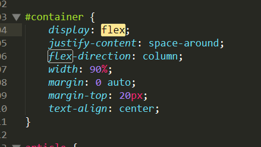

### 9. CSS Breakpoints

I created a seperate css file called responsive.css that holds tablet and desktop breakpoints

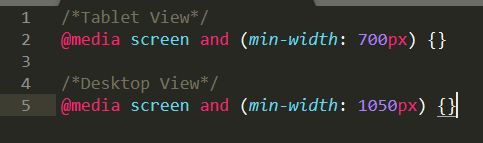

### 10. Instances of Javascript

The index.html has a slideshow animation of four images using javascript

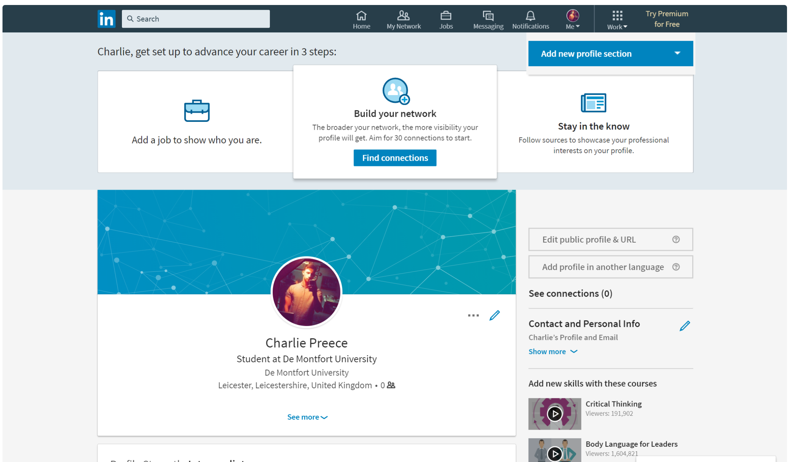

The burger icon is a SVG image that nests the navigation inside it when in tablet or mobile view. Clicking/tapping it open the navigation.

This arrow icon is a SVG image. When clicked/tapped it automatically scrolls to page back to the top.

### 11. Commit History

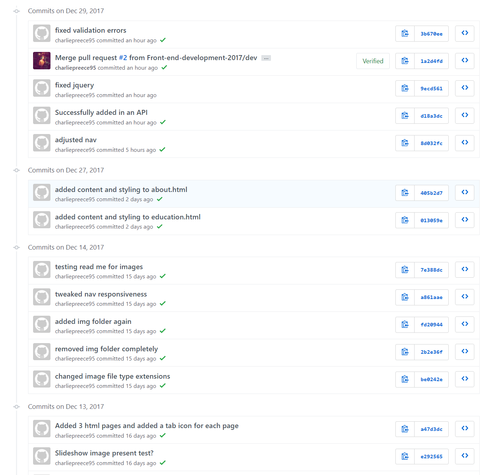

 

- Include usability 
- issues faced
- referencwes
- wireframes
- PARC
- user testing 